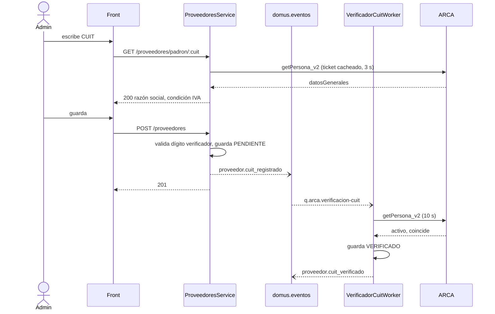
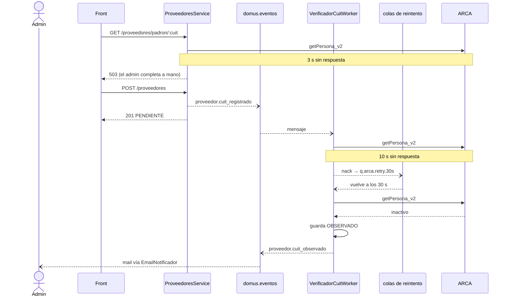

# Domus — Verificación de CUIT contra ARCA (integración SOAP)

> Documento de diseño. No hay nada implementado todavía: describe cómo se
> integraría el padrón de ARCA (ex AFIP) y cómo se apoya en la mensajería de
> [mensajeria.md](mensajeria.md).

---

## 1. Qué resuelve

Proveedores y consorcios tienen una columna `cuit`. Hoy se guarda lo que se
escribe, sin validar. La integración agrega dos cosas:

1. **Autocompletar** la razón social y la condición frente al IVA mientras el
   administrador carga un proveedor.
2. **Verificar** que el CUIT exista y esté activo, y avisar al administrador si
   no lo está (CUIT dado de baja, inexistente o a nombre de otra razón social).

Servicios de ARCA que intervienen, los dos SOAP:

| Servicio | Para qué |
|---|---|
| **WSAA** (`LoginCms`) | Autenticación. Recibe un pedido firmado con el certificado y devuelve un ticket de acceso (`token` + `sign`) que vale 12 h. |
| **Padrón A5** (`personaServiceA5`, servicio `ws_sr_constancia_inscripcion`) | Consulta de la constancia de inscripción de un CUIT: datos generales, domicilio fiscal, impuestos (IVA, monotributo). |

El ejemplo de todo el documento es el **proveedor**. El consorcio sigue
exactamente el mismo flujo con otra routing key (sección 5).

---

## 2. Diagrama de integración

```
 ┌──────────────┐  (1) GET /proveedores/padron/:cuit   ┌───────────────────────────────────────────┐
 │              │ ───────── SYNC, 3 s máx ───────────▶ │  Backend NestJS                           │
 │  Front admin │                                      │                                           │
 │  (Next.js)   │  (2) POST /proveedores               │  ProveedoresController                    │
 │              │ ───────── SYNC, sin ARCA ──────────▶ │        │                                  │
 └──────────────┘ ◀── 201 { cuitEstado: PENDIENTE } ── │        ▼                                  │
                                                       │  ProveedoresService ──▶ ProveedoresRepo ──┼──▶ Postgres
                                                       │        │  (3) publish                     │   (Supabase)
                                                       │        │  proveedor.cuit_registrado       │     ▲
                                                       └────────┼──────────────────────────────────┘     │
                                                                │ ASYNC                                  │
                                                                ▼                                        │
                                                    ┌──────────────────────┐                             │
                                                    │  RabbitMQ            │                             │
                                                    │  exchange            │                             │
                                                    │  "domus.eventos"     │                             │
                                                    │  (topic)             │                             │
                                                    └──────────────────────┘                             │
                         binding *.cuit_registrado     │               │  binding *.cuit_observado       │
                                  ┌────────────────────┘               └──────────────┐                  │
                                  ▼                                                   ▼                  │
                    ┌──────────────────────────────┐                     ┌─────────────────────────┐     │
                    │ q.arca.verificacion-cuit     │                     │ q.email-notificador     │     │
                    │  └─ VerificadorCuitWorker    │                     │  └─ EmailNotificador    │     │
                    │     (N instancias compiten)  │                     │     → mail al admin     │     │
                    └──────────────┬───────────────┘                     └─────────────────────────┘     │
                                   │ (4) SYNC dentro del worker, 10 s máx por llamada                    │
                                   ▼                                                                     │
                    ┌──────────────────────────────┐   (5) guarda resultado ─────────────────────────────┘
                    │ PadronClient                 │   (6) publish proveedor.cuit_verificado
                    │  ├─ WsaaClient ──── SOAP ────┼──▶ ARCA WSAA  (LoginCms)        | proveedor.cuit_observado
                    │  │   (ticket cacheado 12 h)  │                                 ▲
                    │  └─ getPersona_v2 ── SOAP ───┼──▶ ARCA Padrón A5               │
                    └──────────────────────────────┘                                 │
                                   └─────────────────────────────────────────────────┘
                                          (vuelve al exchange domus.eventos)
```

Ubicación en el repo, respetando la regla de capas:

| Pieza | Dónde | Por qué ahí |
|---|---|---|
| `WsaaClient` | `src/core/arca/` | Es transversal: cualquier otro servicio de ARCA usaría la misma autenticación. |
| `PadronClient` | `src/modules/proveedores/padron.client.ts` | Es la API externa del módulo; el service lo usa, el controller no. |
| `VerificadorCuitWorker` | `src/modules/proveedores/` | Recibe el mensaje y delega en `ProveedoresService`. No hace SOAP ni SQL directo. |
| Publicación de eventos | `src/core/` (infra de mensajería) | La misma que define [mensajeria.md](mensajeria.md). |

---

## 3. Qué tramo es sync y cuál async, y por qué

La regla de fondo: **ARCA es un servicio de un tercero sin SLA para nosotros.**
Nada que el usuario necesite para terminar su tarea puede quedar esperándolo.

| # | Tramo | Modo | Justificación |
|---|---|---|---|
| 1 | Front → `GET /proveedores/padron/:cuit` (autocompletar) | **Sync**, presupuesto total 3 s, sin reintentos | El valor de autocompletar existe solo si llega mientras el admin está mirando el formulario. Un resultado que llega en 2 minutos ya no sirve para eso. Por eso es sync, pero **degradable**: si se pasa del tiempo o ARCA está caído, responde `503` y el formulario sigue siendo manual. |
| 2 | Front → `POST /proveedores` | **Sync**, no toca ARCA | El admin necesita saber ya que el proveedor quedó guardado. Lo único que se valida en línea es el formato y el dígito verificador (módulo 11), que es local y determinístico. El CUIT queda en estado `PENDIENTE`. |
| 3 | `ProveedoresService` → exchange (`proveedor.cuit_registrado`) | **Async** | Desacopla el alta de la disponibilidad de ARCA. `ProveedoresService` no sabe que existe ARCA: publica un hecho ("se registró un CUIT") y sigue. Mañana se puede sumar otra verificación (ej. lista de proveedores observados) sin tocarlo. |
| 4 | Worker → WSAA y Padrón A5 | **Sync** (SOAP es RPC request/response) **dentro de un proceso async** | El protocolo es sincrónico y no se puede cambiar. Lo que sí se controla es *quién* espera: espera el worker, no el usuario. El worker puede reintentar con backoff de minutos u horas sin que nadie lo note. |
| 5 | Worker → Postgres (resultado) | **Sync**, transaccional | Es local y rápido; el estado del CUIT tiene que quedar consistente antes de anunciarlo. |
| 6 | Worker → exchange (`cuit_verificado` / `cuit_observado`) | **Async** | Es un hecho de negocio que puede interesar a varios: hoy al mail, mañana a gastos o auditoría. Pub/sub por la misma razón que en [mensajeria.md](mensajeria.md#2-patrón-elegido-publicaciónsuscripción-pubsub). |
| 7 | `EmailNotificador` → SMTP | **Async** | Notificar nunca bloquea la operación principal (regla del `Notificador`). |

**Por qué no hacer todo sync dentro del `POST`:** el alta pasaría a depender de
dos llamadas SOAP en serie (WSAA + A5). Un ARCA lento, que en fechas de
vencimientos impositivos es lo normal, dejaría al administrador sin poder
cargar proveedores. Además el `POST` tendría que decidir qué hacer ante un
timeout, y para eso no tiene una buena respuesta.

**Por qué no hacer todo async (sin el tramo 1):** se puede, y el sistema
funciona igual. El tramo 1 existe solo por UX y por eso es el único que se
permite fallar rápido y en silencio.

---

## 4. Contratos

### 4.1 WSAA — `LoginCms`

| | Homologación | Producción |
|---|---|---|
| Endpoint | `https://wsaahomo.afip.gov.ar/ws/services/LoginCms` | `https://wsaa.afip.gov.ar/ws/services/LoginCms` |

**Operación:** `loginCms(in0: string) → loginCmsReturn: string`

**Entrada (`in0`):** un TRA (*Ticket de Requerimiento de Acceso*) firmado en
CMS/PKCS#7 con el certificado del CUIT y codificado en base64. El TRA antes de
firmar:

```xml
<loginTicketRequest version="1.0">
  <header>
    <uniqueId>1759420800</uniqueId>
    <generationTime>2026-10-02T12:00:00-03:00</generationTime>
    <expirationTime>2026-10-02T12:10:00-03:00</expirationTime>
  </header>
  <service>ws_sr_constancia_inscripcion</service>
</loginTicketRequest>
```

**Salida (`loginCmsReturn`):** un XML como string.

```xml
<loginTicketResponse version="1.0">
  <header>
    <source>CN=wsaahomo, O=AFIP, C=AR, SERIALNUMBER=CUIT 33693450239</source>
    <destination>SERIALNUMBER=CUIT 20XXXXXXXXX, CN=domus</destination>
    <uniqueId>...</uniqueId>
    <generationTime>2026-10-02T12:00:01-03:00</generationTime>
    <expirationTime>2026-10-03T00:00:01-03:00</expirationTime>
  </header>
  <credentials>
    <token>PD94bWwgdm...</token>
    <sign>Hj3kD8...</sign>
  </credentials>
</loginTicketResponse>
```

**Faults relevantes:**

| Fault | Qué significa | Cómo se trata |
|---|---|---|
| `coe.alreadyAuthenticated` | Ya hay un ticket vigente para ese certificado y servicio. | Usar el que está guardado. Si se perdió, ver sección 6.3. |
| `cms.cert.expired` / `cms.cert.invalid` | Certificado vencido o mal firmado. | No es transitorio: no se reintenta, se alerta. |
| `xml.generationTime.invalid` | Reloj del servidor desfasado. | No es transitorio: corregir NTP. |

### 4.2 Padrón A5 — `personaServiceA5`

| | Homologación | Producción |
|---|---|---|
| Endpoint | `https://awshomo.afip.gov.ar/sr-padron/webservices/personaServiceA5` | `https://aws.afip.gov.ar/sr-padron/webservices/personaServiceA5` |

**Operación principal:** `getPersona_v2`

| Parámetro | Tipo | Descripción |
|---|---|---|
| `token` | string | Del ticket WSAA. |
| `sign` | string | Del ticket WSAA. |
| `cuitRepresentada` | long | CUIT dueño del certificado (el de Domus). |
| `idPersona` | long | CUIT a consultar. |

**Respuesta (`personaReturn`), campos que se usan:**

```
personaReturn
├── datosGenerales
│   ├── tipoPersona            FISICA | JURIDICA
│   ├── razonSocial            (jurídicas)
│   ├── nombre, apellido       (físicas)
│   ├── estadoClave            ACTIVO | INACTIVO
│   └── domicilioFiscal        { direccion, localidad, codPostal, descripcionProvincia }
├── datosRegimenGeneral
│   └── impuesto[]             { idImpuesto, descripcionImpuesto }   ← IVA = 30
├── datosMonotributo
│   └── categoriaMonotributo   { descripcionCategoria }
├── errorConstancia            { error[] }   ← ej. CUIT inexistente o sin constancia
└── metadata                   { fechaHora, servidor }
```

**Operación auxiliar:** `dummy() → { appserver, authserver, dbserver }`.
No requiere ticket. Se usa como sonda de salud del circuit breaker (6.2).

> Los nombres de campos están tomados de la documentación pública de ARCA.
> Antes de implementar hay que contrastarlos con el WSDL de homologación
> (`...personaServiceA5?WSDL`), que es el contrato real.

### 4.3 Contrato interno: `PadronClient`

El resto del sistema no ve SOAP. Ve esto:

```ts
type ResultadoPadron =
  | { tipo: 'ENCONTRADO'; cuit: string; razonSocial: string; activo: boolean;
      condicionIva: 'RESPONSABLE_INSCRIPTO' | 'MONOTRIBUTO' | 'EXENTO' | 'NO_ALCANZADO';
      domicilioFiscal: string | null }
  | { tipo: 'INEXISTENTE'; cuit: string }

interface PadronClient {
  /** Lanza ArcaNoDisponibleError ante timeout, 5xx o circuito abierto. */
  consultar(cuit: string, opciones: { timeoutMs: number }): Promise<ResultadoPadron>
}
```

La distinción importante es **error de negocio vs. error técnico**:
`INEXISTENTE` es una respuesta válida y se guarda. `ArcaNoDisponibleError` no
dice nada sobre el CUIT y se reintenta.

### 4.4 Endpoint REST del tramo sync

`GET /proveedores/padron/:cuit` — rol `ADMINISTRADOR`.

| Status | Cuándo | Qué hace el front |
|---|---|---|
| `200` | ARCA respondió con datos | Autocompleta razón social y condición IVA. |
| `404` | ARCA dice que el CUIT no existe | Marca el campo con advertencia. No bloquea el alta. |
| `422` | Falla el dígito verificador | Error de validación. No se llamó a ARCA. |
| `503` | Timeout, ARCA caído o circuito abierto | Nada visible. El formulario sigue manual. |

---

## 5. Mensajería

### 5.1 Topología

Se reutiliza el exchange **`domus.eventos`** (`topic`, durable) y el sobre
común de [mensajeria.md](mensajeria.md#sobre-de-mensaje-común-a-todos-los-eventos).
No se crea un exchange nuevo: estos son hechos de negocio igual que los otros.

### 5.2 Eventos publicados

| Routing key | Quién publica | Cuándo |
|---|---|---|
| `proveedor.cuit_registrado` | `ProveedoresService` | Alta de un proveedor con CUIT, o cambio de CUIT en una edición. |
| `consorcio.cuit_registrado` | `ConsorciosService` | Igual, para el consorcio. |
| `proveedor.cuit_verificado` | `VerificadorCuitWorker` | ARCA confirmó que el CUIT existe, está activo y coincide. |
| `proveedor.cuit_observado` | `VerificadorCuitWorker` | ARCA respondió, pero algo no cierra (ver `motivo`). |
| `consorcio.cuit_verificado` / `consorcio.cuit_observado` | `VerificadorCuitWorker` | Ídem para el consorcio. |

Que ARCA no responda **no** es un evento de negocio: es una falla técnica. Se
resuelve con reintentos y DLQ (sección 6), no se publica.

**Payloads:**

| Routing key | Campos del `payload` |
|---|---|
| `*.cuit_registrado` | `entidad_id`, `cuit`, `origen` (`alta` \| `modificacion` \| `reverificacion`) |
| `*.cuit_verificado` | `entidad_id`, `cuit`, `razon_social_arca`, `condicion_iva` |
| `*.cuit_observado` | `entidad_id`, `cuit`, `motivo` (`INEXISTENTE` \| `INACTIVO` \| `RAZON_SOCIAL_DISTINTA`), `detalle` |

El `cuit` viaja en el payload a propósito: el worker lo compara con el CUIT
actual de la entidad para descartar mensajes viejos (6.4).

### 5.3 Consumidores, colas y por qué

| Consumidor | Cola | Binding | Semántica | Por qué consume |
|---|---|---|---|---|
| `VerificadorCuitWorker` | `q.arca.verificacion-cuit` | `*.cuit_registrado` | **Cola de trabajo** (competing consumers) | Cada CUIT tiene que verificarse **una vez**, no una vez por instancia. Varias instancias del worker leen la **misma** cola y RabbitMQ reparte. `prefetch` bajo (1–2) limita la concurrencia contra ARCA. El comodín `*` hace que consorcios entren sin tocar nada. |
| `EmailNotificador` | `q.email-notificador` (ya existe) | se agrega `*.cuit_observado` | **Pub/sub** | El admin tiene que enterarse de que está por pagarle a un CUIT dado de baja. Un verificado no se notifica: no hay nada que hacer. |
| `MuroNovedadesPublicador` | — | **ninguno** | — | Los proveedores son información interna de la administración, no una novedad del edificio para los vecinos. Igual que `reclamo.cerrado`, el filtro por topic es lo que evita que se filtre. |

`*.cuit_verificado` hoy no tiene consumidor. Se publica igual: es barato, un
`topic` sin binding lo descarta, y deja el punto de extensión para el módulo
de gastos o una auditoría sin tocar el worker.

**En resumen, cola vs tópico:** el *pedido de trabajo* se consume como cola,
con un solo procesador por mensaje. Los *resultados* se distribuyen como tópico,
y cada interesado tiene su propia cola. Las dos cosas viven en el mismo
exchange topic: lo que cambia es cuántas colas se bindean a cada routing key.

> ⚠️ **Impacto en [mensajeria.md](mensajeria.md):** hoy `EmailNotificador`
> está bindeado a `#` (todos los eventos). Con estos eventos recibiría también
> `cuit_registrado` y `cuit_verificado`, que no tienen que generar mail.
> Propuesta: reemplazar `#` por la lista explícita de routing keys que sí
> notifica. Es una decisión del equipo (sección 9).

### 5.4 Colas auxiliares para reintentos

```
q.arca.verificacion-cuit ──(nack, intento n)──▶ x.arca.reintento (direct)
                                                    │
     ┌──────────────────┬──────────────────┬────────┴─────────┬──────────────────┐
     ▼                  ▼                  ▼                  ▼                  ▼
 q.arca.retry.30s   q.arca.retry.2m   q.arca.retry.10m   q.arca.retry.1h   q.arca.verificacion-cuit.dlq
 (TTL 30 s)         (TTL 2 min)       (TTL 10 min)       (TTL 1 h)         (sin TTL, revisión manual)
     └──────────────────┴──────────────────┴──────────────────┘
                 al vencer el TTL, dead-letter de vuelta a q.arca.verificacion-cuit
```

El número de intento viaja en el header `x-intento`. El backoff lo hace el
broker con TTL + dead-letter, no un `sleep` dentro del worker: un worker
durmiendo ocupa un slot de `prefetch` y no procesa nada más.

---

## 6. El desafío del timeout

El problema de llamar a un servicio externo no es que falle, sino que **no
responda**. Un timeout no dice si la operación se hizo o no. Hay que resolver
qué hacer con esa incertidumbre en cada llamada.

### 6.1 Presupuestos de tiempo explícitos

Ninguna llamada a ARCA usa el timeout por defecto de la librería, que en
algunos clientes SOAP es infinito.

| Llamada | Connect | Total | Reintentos en línea |
|---|---|---|---|
| Tramo sync (autocompletar) | 1 s | 3 s | 0 |
| Worker → Padrón A5 | 2 s | 10 s | 0 (los reintentos van por el broker) |
| Worker → WSAA | 2 s | 15 s | 0 |

El tramo sync tiene una restricción más: **solo usa un ticket WSAA ya
cacheado**. Si no hay ticket vigente, responde `503` al instante y el worker
lo renueva. Así el usuario espera como máximo una llamada SOAP, no dos.

### 6.2 Circuit breaker

Si ARCA está caído, seguir mandándole llamadas solo suma timeouts.

- **Cerrado** (normal): las llamadas pasan.
- **Abierto**: después de 5 fallas técnicas consecutivas. Durante 5 min no se
  llama a ARCA. El tramo sync responde `503` sin esperar y el worker manda el
  mensaje directo a la cola de reintento siguiente, sin gastar el timeout.
- **Semiabierto**: pasados los 5 min se llama a `dummy()`. Si responde OK, se
  cierra. Si no, vuelve a abierto.

El estado del circuito se comparte entre el tramo sync y el worker: los dos
llaman al mismo ARCA.

### 6.3 Timeout en Padrón A5 vs. timeout en WSAA

Las dos llamadas tienen riesgos de timeout muy distintos:

**Padrón A5 (`getPersona_v2`) — timeout inofensivo.** Es una consulta: no
cambia nada del lado de ARCA. Si se cortó, reintentarla es seguro. No hay
duplicados posibles. Por eso se reintenta sin más (5.4).

> Contraste con Mercado Pago: ahí un timeout al crear un pago sí es ambiguo
> ("¿se cobró o no?") y por eso necesita idempotencia y reconciliación. Acá no.

**WSAA (`loginCms`) — timeout peligroso.** Pedir un ticket *sí* tiene efecto del
lado de ARCA: si el pedido llegó y lo que se cortó fue la respuesta, ARCA
emitió un ticket que nunca recibimos. El siguiente pedido devuelve
`coe.alreadyAuthenticated`, y el ticket no se puede volver a pedir hasta que
vence (hasta 12 h). Durante esa ventana no se puede consultar el padrón.

Cómo se mitiga:

1. **El ticket se persiste en la base** (tabla `arca_ticket_acceso`), no solo en
   memoria. Un reinicio o un deploy no lo pierden, que es la causa más común
   del problema.
2. **Renovación anticipada y única.** Se renueva cuando le queda menos de 1 h,
   no cuando ya venció. Con varias instancias del backend, una sola renueva:
   un `pg_advisory_lock` sobre una clave fija hace que las demás esperen y
   lean el ticket nuevo de la tabla.
3. **Ante `alreadyAuthenticated` sin ticket guardado**, se marca WSAA como
   bloqueado hasta `momento del pedido + 12 h`, se alerta, y los mensajes van a
   la cola de reintento de 1 h en vez de quemar intentos.
4. **Contingencia (a confirmar con ARCA):** un segundo certificado autorizado
   para el mismo servicio. El ticket es por certificado, así que el segundo
   no queda bloqueado por el primero.

### 6.4 Idempotencia del worker

El worker puede recibir el mismo mensaje dos veces: un reintento después de
procesarlo pero antes del `ack`, o dos ediciones seguidas del mismo proveedor.

- Antes de llamar a ARCA, el worker compara `payload.cuit` con el CUIT actual
  del proveedor. Si no coinciden, el mensaje es viejo: `ack` y se descarta.
- Si el proveedor ya está `VERIFICADO` u `OBSERVADO` para ese mismo CUIT,
  también se descarta.
- Guardar el resultado y decidir qué evento publicar es una sola operación del
  service. El `ack` va recién después de publicar.

### 6.5 Qué pasa si el evento nunca se publica

Si el backend se cae entre guardar el proveedor y publicar `cuit_registrado`, el
proveedor queda `PENDIENTE` para siempre. En lugar de un outbox transaccional
completo, alcanza con un **reconciliador**: una tarea programada
(`@nestjs/schedule`, cada 15 min) que vuelve a publicar `cuit_registrado`
(`origen: reverificacion`) para los `PENDIENTE` con más de 15 min. Funciona
porque el worker es idempotente (6.4).

La misma tarea, con otra frecuencia (mensual), sirve para re-verificar CUITs ya
verificados: un proveedor puede darse de baja en ARCA después de cargado.

### 6.6 Cuando se agotan los reintentos

Después del intento de 1 h el mensaje va a la DLQ y el proveedor queda en
estado `NO_VERIFICABLE`. El sistema sigue funcionando: el proveedor se puede
usar, y en el panel aparece con una marca para que el admin lo revise. La DLQ
se reprocesa a mano cuando ARCA vuelve.

---

## 7. Estados del CUIT y cambios de esquema

```
             alta / cambio de CUIT
                     │
                     ▼
               ┌───────────┐  ARCA ok, activo, coincide  ┌────────────┐
               │ PENDIENTE │ ──────────────────────────▶ │ VERIFICADO │
               └───────────┘                             └────────────┘
                 │       │   ARCA ok, pero inexistente / ┌────────────┐
                 │       └── inactivo / otra razón ────▶ │ OBSERVADO  │
                 │           social                      └────────────┘
                 │  reintentos agotados                  ┌────────────────┐
                 └─────────────────────────────────────▶ │ NO_VERIFICABLE │
                                                         └────────────────┘
          (re-verificación o cambio de CUIT → vuelve a PENDIENTE)
```

Proveedores sin CUIT quedan en `SIN_CUIT` y no entran al flujo.

Cambios en la base, a aplicar en SQL en Supabase y regenerar entities, según
las reglas del repo:

| Tabla | Cambio |
|---|---|
| `proveedor` y `consorcio` | `cuit_estado` (enum de arriba), `cuit_verificado_at timestamptz`, `cuit_observacion text`, `condicion_iva` (enum) |
| `arca_ticket_acceso` (nueva) | `servicio` (PK), `token`, `sign`, `generado_at`, `expira_at` |

El certificado y la clave privada **no** van a la base ni al repo: van en
`.env` o en un secret del entorno.

---

## 8. Secuencias

### 8.1 Camino feliz



### 8.2 ARCA no responde



---

## 9. Decisiones abiertas

1. **Binding de `EmailNotificador`:** pasar de `#` a una lista explícita
   (5.3). Afecta a [mensajeria.md](mensajeria.md).
2. **Qué CUIT firma:** el certificado queda asociado al CUIT y la clave fiscal
   de una persona del equipo. Si esa persona se va, hay que rehacer el trámite.
3. **Coincidencia de razón social:** comparar exacto es demasiado estricto
   ("S.A." vs "SA"). Hay que definir una normalización o tomar siempre la de
   ARCA como válida.
4. **Homologación:** los datos del padrón de prueba pueden no coincidir con
   los reales. Conviene tener preparados un par de CUITs de prueba para la demo.
